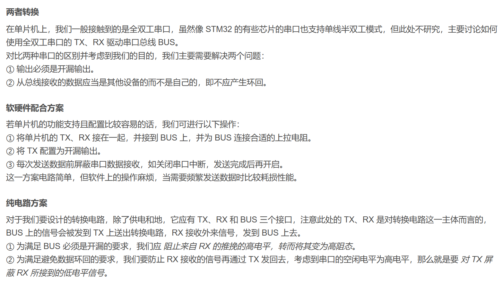

<!--
 * @Author: 小叶同学
 * @Date: 2024-03-21 08:11:42
 * @LastEditors: Please set LastEditors
 * @LastEditTime: 2024-03-21 10:27:33
 * @Description: 请填写简介
-->

# 舵机的控制方案

- 控制方案
  - 直接控制，配置单线半双工协议
  - 间接控制，全双工和半双工协议转换

## 1 直接控制

- 复用推挽输出或者复用开漏输出（只对低电平有驱动力，因此需要弱上拉）
- 外接上拉电阻至3.3V

当没有数据传输时，TX总是被释放。因此，它在空闲状态的或接收状态时表现为一个标准I/O口。这就意味该I/O在不被USART驱动时，必须配置成悬空输入(或开漏的输出高)。

>参考：https://blog.csdn.net/shizhibuyi1234/article/details/85318290

## 2 间接控制

- 输出必须是开漏输出。
- 从总线接收的数据应当是其他设备的而不是自己的，即不应产生环回。

>参考：https://blog.csdn.net/weixin_51914644/article/details/127864886